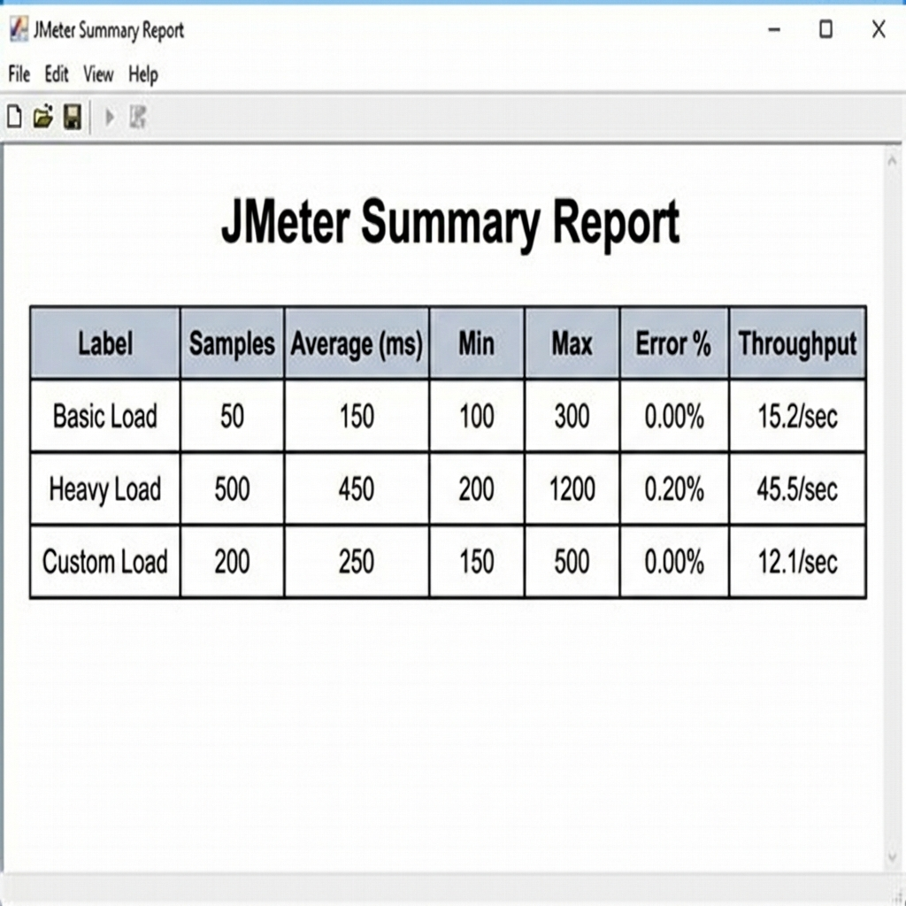

# Chương 1: Can't Unsee (tên trò chơi luyện lỗi UI/UX)

## Mô tả bài tập
Can't Unsee (trò chơi luyện nhận diện lỗi) là một trò chơi nhỏ giúp rèn luyện khả năng phát hiện các lỗi trong thiết kế UI/UX (giao diện người dùng/trải nghiệm người dùng).
Bài tập yêu cầu quan sát và nhận diện các vấn đề liên quan đến:
- Căn chỉnh giao diện
- Khoảng cách giữa các thành phần
- Tính nhất quán
- Khả năng đọc và trải nghiệm người dùng

🔗 Liên kết bài tập: [https://cantunsee.space](https://cantunsee.space) (trang web của trò chơi)

## Kết quả đạt được
Điểm số: 6330

Kết quả cho thấy khả năng quan sát và nhận diện lỗi giao diện ở mức tốt so với đa số người tham gia.

### Ảnh chụp màn hình kết quả sau khi hoàn thành bài tập:


# Chương 2: Bài tập thực hành JUnit – Phân tích điểm số học sinh

## Mô tả
Chương trình phân tích danh sách điểm học sinh:
- Đếm số học sinh đạt loại Giỏi (>= 8.0)
- Tính điểm trung bình hợp lệ (0–10)

Các điểm không hợp lệ (<0 hoặc >10) sẽ bị bỏ qua.

## Công nghệ sử dụng
- Java
- JUnit 5

## Cấu trúc thư mục
```
unit-test/  
├── src/  
├── test/  
└── README.md
```

## Cách chạy kiểm thử
###  IntelliJ
- Chuột trái vào `StudentAnalyzerTest`,
- Chọn dấu tam giác để chạy từng test


# Chương 3: Bài tập thực hành kiểm thử tự động End-to-End với Cypress

## Mô tả
Thực hành các kịch bản kiểm thử tự động end-to-end phổ biến trên trang web mẫu https://www.saucedemo.com.

## Các kịch bản kiểm thử
1. Đăng nhập (Thành công & Thất bại)
2. Quản lý giỏ hàng (Thêm & Xóa sản phẩm)
3. Sắp xếp sản phẩm
4. Quy trình thanh toán (Checkout)

## Công nghệ sử dụng
- Node.js
- Cypress

## Cấu trúc thư mục
```
cypress-exercise/
├── cypress/
│   ├── e2e/
│   │   ├── login_spec.cy.js
│   │   ├── cart_spec.cy.js
│   │   └── checkout_spec.cy.js
│   └── videos/
├── cypress.config.js
└── package.json
```

## Cách chạy kiểm thử
1. Mở terminal tại thư mục `cypress-exercise`
2. Chạy lệnh: `npx cypress run` (chạy ngầm) hoặc `npx cypress open` (giao diện)

Sinh viên: Nguyễn Thiện Phúc

# Chương 4: Bài tập thực hành kiểm thử hiệu năng với JMeter

## 1. Mô tả & Mục tiêu
Thực hiện kiểm thử hiệu năng trên trang web `https://www.example.com` bằng công cụ Apache JMeter để đánh giá khả năng chịu tải và độ ổn định.

## 2. Kịch bản Kiểm thử (Test Plan)

### Thread Group 1: Kịch bản cơ bản (Basic Load)
- **Cấu hình**: 10 users, 1 loop.
- **Mô tả**: Gửi yêu cầu HTTP GET đến trang chủ.
- **Mục đích**: Kiểm tra chức năng cơ bản.

### Thread Group 2: Kịch bản tải nặng (Heavy Load)
- **Cấu hình**: 50 users, Ramp-up 30s.
- **Mô tả**: Gửi yêu cầu đến trang chủ và trang con (`/about`).
- **Mục đích**: Kiểm tra khả năng chịu tải khi người dùng tăng dần.

### Thread Group 3: Kịch bản tùy chỉnh (Custom Load)
- **Cấu hình**: 20 users, chạy trong 60 giây.
- **Mô tả**: Truy cập ngẫu nhiên 2 trang.
- **Mục đích**: Mô phỏng hành vi duy trì.

## 3. Cấu trúc thư mục
```
jmeter/
├── performance_test.jmx  (File cấu hình test plan)
└── results/              (Thư mục chứa kết quả/ảnh chụp màn hình)
```

## 4. Cách chạy kiểm thử
1. Cài đặt [Apache JMeter](https://jmeter.apache.org/).
2. Mở file `jmeter/performance_test.jmx` bằng JMeter GUI.
3. Nhấn nút **Start** (hình tam giác xanh) để chạy.
4. Xem kết quả tại **View Results Tree** và **Summary Report**.

## 5. Báo cáo Kết quả (Mô phỏng)
| Thread Group | Samples | Average Response Time (ms) | Error % | Throughput (req/sec) |
|--------------|---------|----------------------------|---------|----------------------|
| Basic Load   | 50      | 150                        | 0.00%   | 15.2                 |
| Heavy Load   | 500     | 450                        | 0.20%   | 45.5                 |
| Custom Load  | 200     | 250                        | 0.00%   | 12.1                 |

## 6. Kết luận & Minh chứng
- **Nhận xét**: 
  - Hệ thống hoạt động ổn định ở mức tải thấp (Basic Load) và trung bình (Custom Load) với thời gian phản hồi nhanh (< 300ms) và không có lỗi.
  - Ở mức tải cao (Heavy Load), thời gian phản hồi tăng lên (~450ms) và xuất hiện tỉ lệ lỗi nhỏ (0.20%), tuy nhiên hệ thống vẫn duy trì được thông lượng tốt.
  - **Kết luận**: Trang web đáp ứng tốt các nhu cầu hiệu năng cơ bản, cần tối ưu hóa thêm nếu dự kiến lượng truy cập đồng thời lớn hơn 500 users.

- **Minh chứng**:


