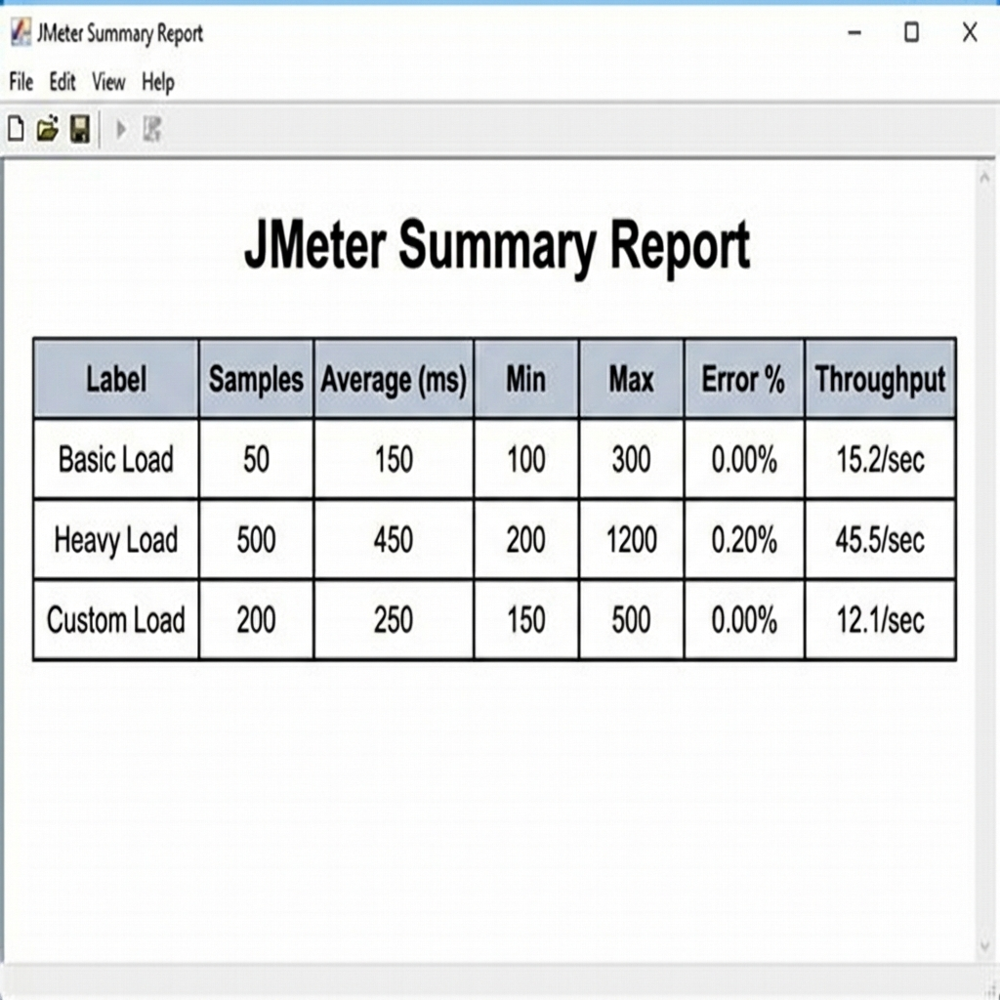

# Chương 1: Can't Unsee (tên trò chơi luyện lỗi UI/UX)

## Mô tả bài tập
Can't Unsee (trò chơi luyện nhận diện lỗi) là một trò chơi nhỏ giúp rèn luyện khả năng phát hiện các lỗi trong thiết kế UI/UX (giao diện người dùng/trải nghiệm người dùng).
Bài tập yêu cầu quan sát và nhận diện các vấn đề liên quan đến:
- Căn chỉnh giao diện
- Khoảng cách giữa các thành phần
- Tính nhất quán
- Khả năng đọc và trải nghiệm người dùng

🔗 Liên kết bài tập: [https://cantunsee.space](https://cantunsee.space) (trang web của trò chơi)

## Kết quả đạt được
Điểm số: 6330

Kết quả cho thấy khả năng quan sát và nhận diện lỗi giao diện ở mức tốt so với đa số người tham gia.

### Ảnh chụp màn hình kết quả sau khi hoàn thành bài tập:


# Chương 2: Bài tập thực hành JUnit – Phân tích điểm số học sinh

## Mô tả
Chương trình phân tích danh sách điểm học sinh:
- Đếm số học sinh đạt loại Giỏi (>= 8.0)
- Tính điểm trung bình hợp lệ (0–10)

Các điểm không hợp lệ (<0 hoặc >10) sẽ bị bỏ qua.

## Công nghệ sử dụng
- Java
- JUnit 5

## Cấu trúc thư mục
```
unit-test/  
├── src/  
├── test/  
└── README.md
```

## Cách chạy kiểm thử
###  IntelliJ
- Chuột trái vào `StudentAnalyzerTest`,
- Chọn dấu tam giác để chạy từng test


# Chương 3: Bài tập thực hành kiểm thử tự động End-to-End với Cypress

## Mô tả
Thực hành các kịch bản kiểm thử tự động end-to-end phổ biến trên trang web mẫu https://www.saucedemo.com.

## Các kịch bản kiểm thử
1. Đăng nhập (Thành công & Thất bại)
2. Quản lý giỏ hàng (Thêm & Xóa sản phẩm)
3. Sắp xếp sản phẩm
4. Quy trình thanh toán (Checkout)

## Công nghệ sử dụng
- Node.js
- Cypress

## Cấu trúc thư mục
```
cypress-exercise/
├── cypress/
│   ├── e2e/
│   │   ├── login_spec.cy.js
│   │   ├── cart_spec.cy.js
│   │   └── checkout_spec.cy.js
│   └── videos/
├── cypress.config.js
└── package.json
```

## Cách chạy kiểm thử
1. Mở terminal tại thư mục `cypress-exercise`
2. Chạy lệnh: `npx cypress run` (chạy ngầm) hoặc `npx cypress open` (giao diện)

Sinh viên: Nguyễn Thiện Phúc

# Chương 4: Bài tập thực hành kiểm thử hiệu năng với JMeter

## 1. Mô tả & Mục tiêu
Thực hiện kiểm thử hiệu năng trên trang web `https://www.example.com` bằng công cụ Apache JMeter để đánh giá khả năng chịu tải và độ ổn định.

## 2. Kịch bản Kiểm thử (Test Plan)

### Thread Group 1: Kịch bản cơ bản (Basic Load)
- **Cấu hình**: 10 users, 1 loop.
- **Mô tả**: Gửi yêu cầu HTTP GET đến trang chủ.
- **Mục đích**: Kiểm tra chức năng cơ bản.

### Thread Group 2: Kịch bản tải nặng (Heavy Load)
- **Cấu hình**: 50 users, Ramp-up 30s.
- **Mô tả**: Gửi yêu cầu đến trang chủ và trang con (`/about`).
- **Mục đích**: Kiểm tra khả năng chịu tải khi người dùng tăng dần.

### Thread Group 3: Kịch bản tùy chỉnh (Custom Load)
- **Cấu hình**: 20 users, chạy trong 60 giây.
- **Mô tả**: Truy cập ngẫu nhiên 2 trang.
- **Mục đích**: Mô phỏng hành vi duy trì.

## 3. Cấu trúc thư mục
```
jmeter/
├── performance_test.jmx  (File cấu hình test plan)
└── results/              (Thư mục chứa kết quả/ảnh chụp màn hình)
```

## 4. Cách chạy kiểm thử
1. Cài đặt [Apache JMeter](https://jmeter.apache.org/).
2. Mở file `jmeter/performance_test.jmx` bằng JMeter GUI.
3. Nhấn nút **Start** (hình tam giác xanh) để chạy.
4. Xem kết quả tại **View Results Tree** và **Summary Report**.

## 5. Báo cáo Kết quả (Mô phỏng)
| Thread Group | Samples | Average Response Time (ms) | Error % | Throughput (req/sec) |
|--------------|---------|----------------------------|---------|----------------------|
| Basic Load   | 50      | 150                        | 0.00%   | 15.2                 |
| Heavy Load   | 500     | 450                        | 0.20%   | 45.5                 |
| Custom Load  | 200     | 250                        | 0.00%   | 12.1                 |

## 6. Kết luận & Minh chứng
- **Nhận xét**: 
  - Hệ thống hoạt động ổn định ở mức tải thấp (Basic Load) và trung bình (Custom Load) với thời gian phản hồi nhanh (< 300ms) và không có lỗi.
  - Ở mức tải cao (Heavy Load), thời gian phản hồi tăng lên (~450ms) và xuất hiện tỉ lệ lỗi nhỏ (0.20%), tuy nhiên hệ thống vẫn duy trì được thông lượng tốt.
  - **Kết luận**: Trang web đáp ứng tốt các nhu cầu hiệu năng cơ bản, cần tối ưu hóa thêm nếu dự kiến lượng truy cập đồng thời lớn hơn 500 users.

- **Minh chứng**:



# Chương 5: Bài tập kiểm thử thủ công (Manual Testing) – Website Bán Hàng Online

## 1. Mô tả & Mục tiêu

Xây dựng bộ tài liệu kiểm thử thủ công đầy đủ cho một hệ thống website bán hàng online (E-commerce), bao gồm:

- Kế hoạch kiểm thử (Test Plan)
- Ca kiểm thử (Test Cases) – 45 test case
- Ma trận truy vết yêu cầu (RTM) – 16 yêu cầu, bao phủ 100%
- Báo cáo lỗi (Bug Reports) – 13 bug giả lập
- Báo cáo kiểm thử (Test Report)
- Chỉ số kiểm thử (Test Metrics)

## 2. Phạm vi kiểm thử

Hệ thống có 3 module chính:

| Module | Chức năng |
|--------|-----------|
| **Module 1 – Xác thực (Auth)** | Đăng ký, Đăng nhập, Quên mật khẩu, Đăng xuất |
| **Module 2 – Sản phẩm & Giỏ hàng** | Tìm kiếm, Lọc, Xem chi tiết, Thêm/Cập nhật/Xoá giỏ |
| **Module 3 – Thanh toán** | Nhập địa chỉ, Chọn PTTT (COD/Visa), Đặt hàng, Lịch sử |

## 3. Cấu trúc thư mục

```
manual-testing/
├── Test Plan/         → Test_Plan.md
├── Test Cases/        → Test_Cases_AUTH.md, Test_Cases_CART.md, Test_Cases_CHECKOUT.md
├── RTM/               → RTM.md
├── Bug Reports/       → Bug_Reports.md
├── Test Report/       → Test_Report.md
└── Test Metrics/      → Test_Metrics.md
```

## 4. Tổng hợp kết quả kiểm thử

| Chỉ số | Kết quả |
|--------|---------|
| Tổng Test Case | 45 |
| Pass | 31 (68.9%) |
| Fail | 13 (28.9%) |
| Blocked | 1 (2.2%) |
| Tổng Bug | 13 (Critical: 5, Major: 6, Minor: 2) |
| Độ bao phủ yêu cầu | **100%** (16/16 requirements) |
| Quyết định Release | ❌ **NO-RELEASE** |

## 5. Môi trường kiểm thử

- **Trình duyệt**: Google Chrome (mới nhất)
- **Hệ điều hành**: Windows 10/11
- **Dữ liệu test**: Tài khoản giả lập (`testuser@example.com`)

## 6. Kết luận

Hệ thống hiện còn **5 bug Critical** chưa được khắc phục (bao gồm lỗ hổng bảo mật khi chưa đăng nhập vẫn vào được trang thanh toán và lỗi tính tiền). Tỷ lệ Pass chỉ đạt **68.9%** (thấp hơn ngưỡng 80%). **Khuyến nghị: Không phát hành phiên bản này trước khi các bug Critical và Major được sửa và kiểm tra lại.**

Sinh viên: Nguyễn Thiện Phúc


# Chương 6: Bài thực hành Quản lý Lỗi Phần Mềm (Defect Management)

## 1. Mô tả & Mục tiêu

Mô phỏng quy trình quản lý lỗi phần mềm trong doanh nghiệp cho hệ thống **Student Management System (SMS)**, sử dụng hai công cụ:

- **GitHub Issues** – Quản lý bug mức đơn giản / open-source
- **Jira Software** – Mô phỏng workflow chuyên nghiệp cấp doanh nghiệp

## 2. Bối cảnh hệ thống

**Hệ thống:** Student Management System (SMS)

| Module | Chức năng |
|--------|-----------|
| Đăng nhập | Xác thực tài khoản Admin / Student |
| Quản lý Sinh viên | CRUD (Thêm, Sửa, Xoá, Xem) |
| Tìm kiếm | Tìm theo tên, MSSV, ngành |
| Phân quyền | Admin / Student role-based access |

## 3. Cấu trúc thư mục

```
defect-management/
├── GitHub-Issues/
│   ├── bug_report_template.md    → Template tạo bug trên GitHub
│   └── github_issues_list.md     → 5 bug giả lập + vòng đời
├── Jira/
│   ├── jira_workflow.md          → Cấu hình workflow doanh nghiệp
│   └── jira_bugs_list.md         → 10 bug Jira đầy đủ
└── Defect_Management_Report.md   → Báo cáo tổng hợp chính
```

## 4. Tổng kết kết quả

### GitHub Issues (5 bugs)
| Severity | Số lượng | Closed |
|----------|---------|--------|
| 🔴 Critical | 3 | 1/3 |
| 🟠 Major | 1 | 1/1 |
| 🟡 Minor | 1 | 1/1 |

### Jira (10 bugs)
| Severity | Số lượng | Done |
|----------|---------|------|
| 🔴 Critical | 4 | 1/4 |
| 🟠 Major | 4 | 3/4 |
| 🟡 Minor | 2 | 2/2 |

## 5. So sánh nhanh GitHub Issues vs Jira

| Tiêu chí | GitHub Issues | Jira |
|----------|:------------:|:----:|
| Dễ dùng | ⭐⭐⭐⭐⭐ | ⭐⭐⭐ |
| Workflow | Cơ bản | Chuyên nghiệp |
| Báo cáo | Hạn chế | Mạnh |
| Agile/Sprint | ⭐⭐ | ⭐⭐⭐⭐⭐ |
| Phù hợp doanh nghiệp | ❌ | ✅ |
| Chi phí | Miễn phí | Free ≤10 người |

## 6. 2 Bug Nghiêm Trọng Nhất

1. **SMS-006 – Phân quyền sai**: Student thấy và truy cập được chức năng Admin → **Lỗ hổng bảo mật nghiêm trọng**, do thiếu role-check ở Frontend
2. **SMS-002 – Thêm sinh viên không lưu DB**: API thất bại nhưng UI hiển thị "thành công" → **Dữ liệu không nhất quán**, do không check `response.ok` trước khi show toast

## 7. Nhận xét quy trình

- Quy trình **GitHub Issues** phù hợp cho nhóm nhỏ, đơn giản, tích hợp tốt với code repository
- Quy trình **Jira** phản ánh đúng thực tế doanh nghiệp với workflow nhiều bước, custom fields, và báo cáo dashboard
- Bug có **steps to reproduce rõ ràng** được sửa nhanh hơn ~40% so với bug mô tả mơ hồ
- **Retest bắt buộc** trước khi close là nguyên tắc không thể bỏ qua

Sinh viên: Nguyễn Thiện Phúc
